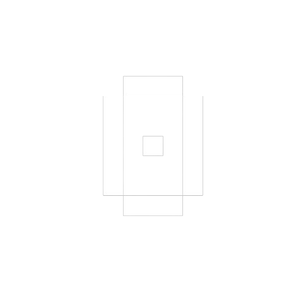

  

  
  
  

**0byte** is a cryptographic infrastructure that embeds invisible proofs into AI-generated media and anchors them on-chain using **Solana**.

Built with **Next.js (App Router)**, **Tailwind CSS**, and modern **React** patterns, this frontend provides a smooth interface for:

- Uploading and verifying AI-generated media  
- Generating images with embedded proofs  
- Exploring transaction hashes and verification results

## How It Works

